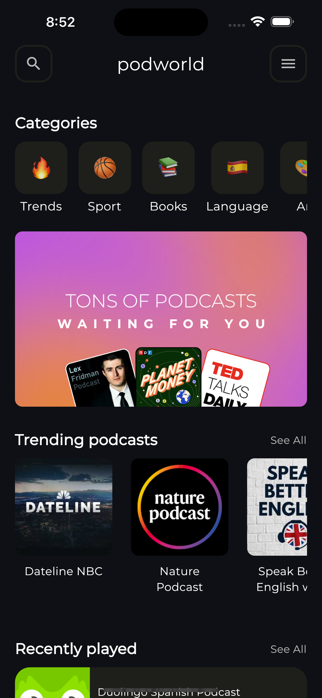
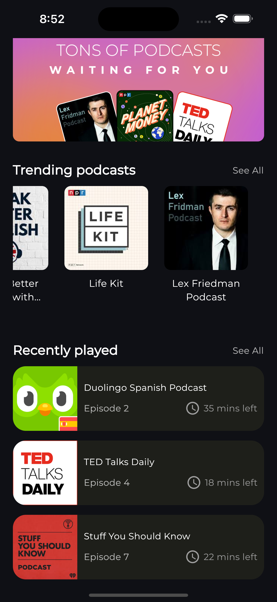
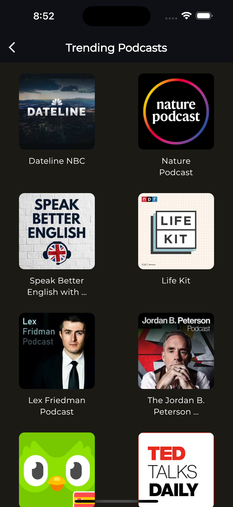
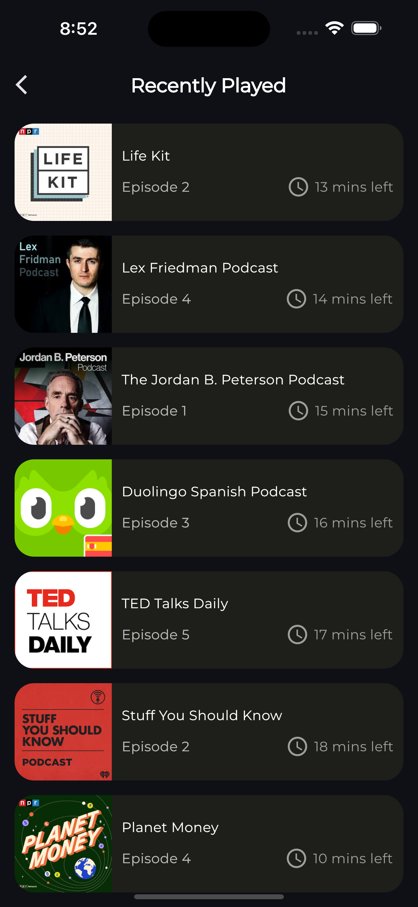
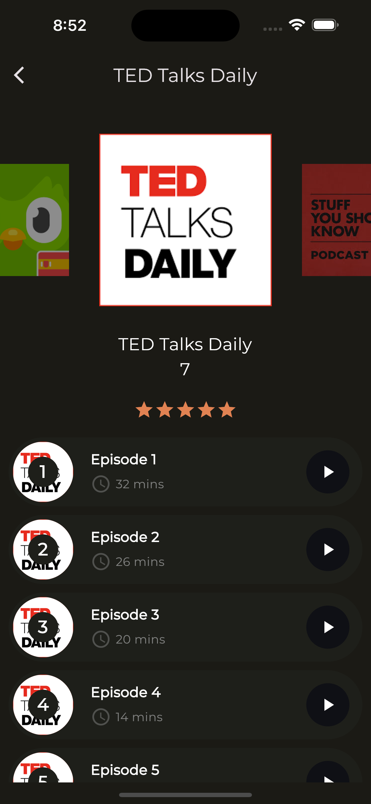
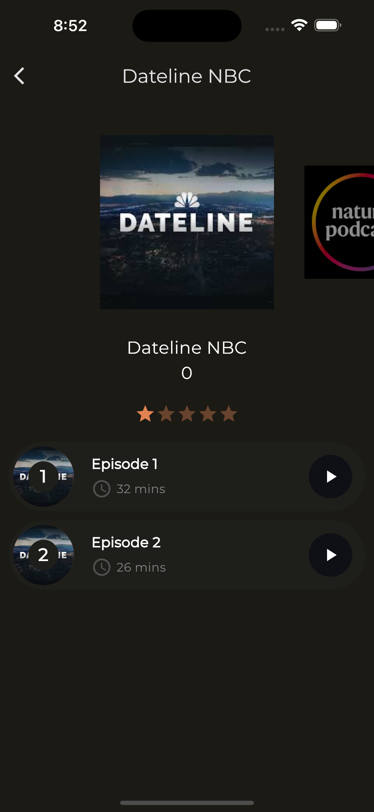
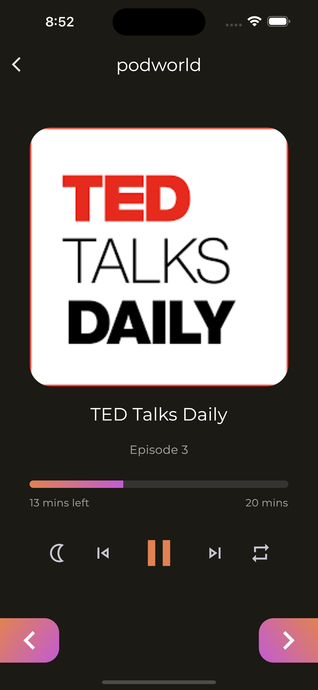
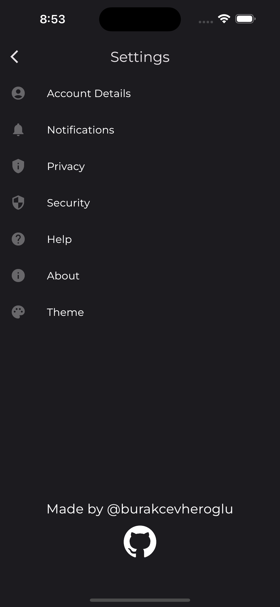

# Podcast App

I made podcast app and designed 6 different pages. Also riverpod state management used.

## Screenshots
### Main Screen

| First Screen       |  First Screen          |
| ------------- |:-------------:|
|      |  |

### See All Screens

| Trending Podcasts Screen       |  Recently Played Screen          |
| ------------- |:-------------:|
|      |  |

### Podcast Screen

| Podcast  Screen       |  Podcast Screen          |
| ------------- |:-------------:|
|      |  |

### Episode and Setting Screens

| Episode  Screen       |  Settings Screen          |
| ------------- |:-------------:|
|      |  |
